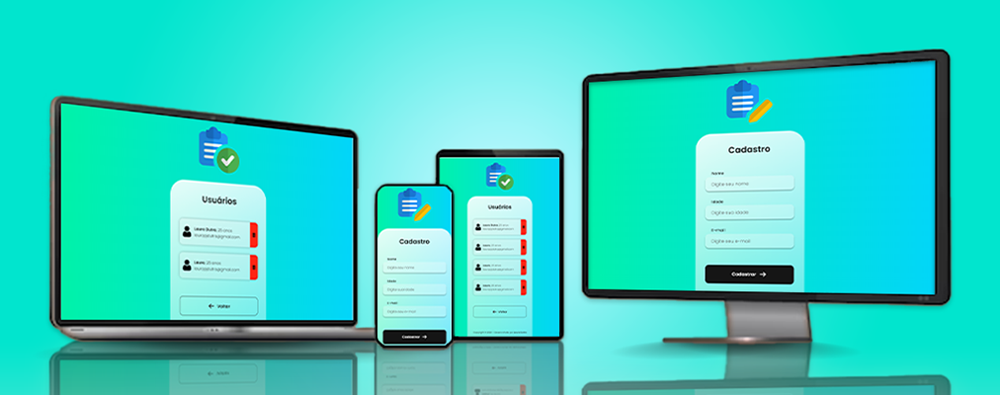

## 📝 Sobre

O projeto <b>User Register</b> apresenta um formulário para cadastro de usuários, incluindo nome, idade e e-mail. Após o cadastro, os usuários são exibidos em uma lista de cards personalizados. O projeto foi desenvolvido tanto para desktops quanto para dispositivos móveis, contando com um design responsivo que se adapta a qualquer formato de tela.

## ⚙ Funcionalidades

Na tela de cadastro, o usuário deve inserir nome, idade e e-mail nos respectivos campos e clicar em <i>Cadastrar</i> para criar os dados na API e ser direcionado para a tela de usuários. Esta tela exibe uma lista de cards personalizados com as informações dos usuários cadastrados. O botão <i>Excluir</i>, simbolizado pelo ícone de uma lixeira, deleta o usuário da API e o botão <i>Voltar</i> retorna à página principal, onde o usuário pode fazer um novo cadastro.

## 🖥 Tecnologias

O projeto foi desenvolvido utilizando React.js para criação da interface do usuário e a biblioteca Axios para requisições HTTP. O código foi organizado em componentes reutilizáveis para facilitar a manutenção e escalabilidade do projeto. Além disso, a estilização foi feita utilizando styled-components, permitindo a criação de estilos de forma declarativa e encapsulada, o que ajuda a evitar conflitos e facilita a manutenção do código. A combinação dessas tecnologias proporcionou uma experiência de desenvolvimento ágil e eficiente, resultando em um projeto bem estruturado, modular e esteticamente agradável.